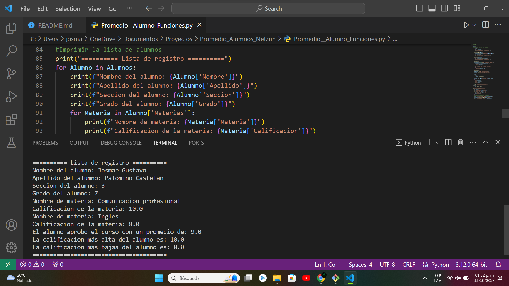
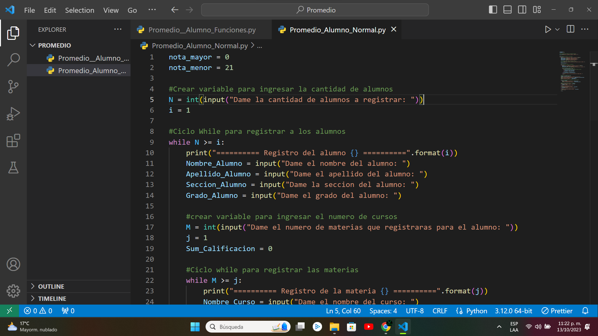
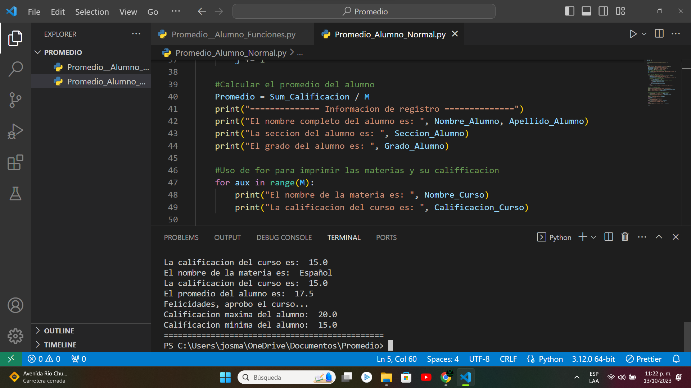
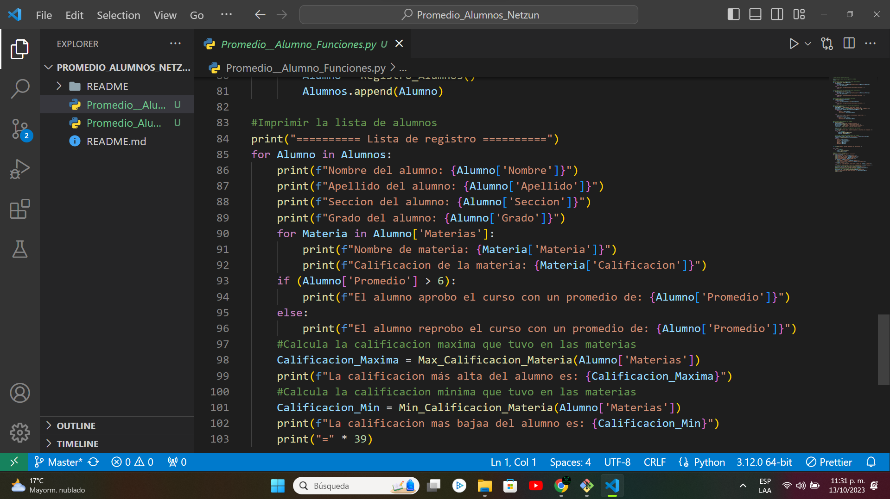
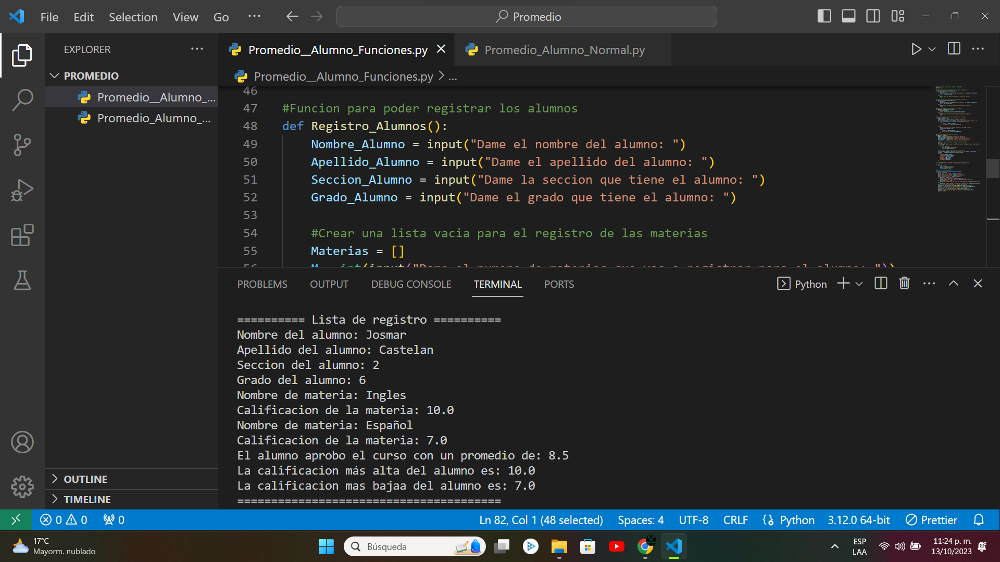

# Sistema de Registro de Alumnos

Este repositorio **es un proyecto creado con el propósito de ser evaluado en el contexto de un curso de Fundamentos de Python**, con el objetivo de obtener la certificación correspondiente. Su función principal es **calcular el promedio de calificaciones de los estudiantes** utilizando exclusivamente los conceptos esenciales de Python.

<h1 align="center"> Sistema de Registro de Alumnos </h1>

 Presentación del programa 

# Tabla de contenidos:

---

- [Badges](#badges)
- [Capturas de pantalla](#capturas-de-pantalla)
- [Descripción del proyecto](#descripción-del-proyecto)
- [Guía de instalación](#guía-de-instalación)
- [Autor](#autores)
- [Información adicional](#información-adicional)

# Badges

---

- Estado del Proyecto: 
- Versión Actual: 

# Capturas de pantalla

---

Las capturas a continuación exhiben dos códigos que se encuentran en el repositorio. Uno de ellos emplea únicamente los fundamentos de Python, mientras que el segundo hace uso de listas para mantener un registro de todas las materias de cada alumno.

## Capturas de pantalla con fundamentos de Python

## Capturas de pantalla con funciones y listas

# Descripción del proyecto

---

Este proyecto tiene como objetivo crear **un sistema de registro de alumnos y sus calificaciones en diferentes materias**. El sistema permite a los usuarios ingresar información de múltiples alumnos y las calificaciones de las materias que han cursado. Las características clave del proyecto son:

1. **Registro de Alumnos:** Los usuarios pueden ingresar información detallada de cada alumno, incluyendo su nombre, apellido, sección y grado.
2. **Registro de Materias:** Para cada alumno, el sistema permite registrar múltiples materias, incluyendo el nombre de la materia y la calificación obtenida.
3. **Validación de Calificaciones:** El sistema valida que las calificaciones ingresadas estén en el rango válido (0-10).
4. **Cálculo de Estadísticas:** Se calcula la calificación máxima, la calificación mínima y el promedio de las calificaciones de todas las materias de cada alumno.
5. **Evaluación de Desempeño:** Con base en el promedio de las calificaciones, el sistema determina si el alumno ha aprobado o desaprobado el curso. Si el promedio supera 10.5, se considera que el alumno ha aprobado.
6. **Visualización de Resultados:** El sistema muestra información detallada de cada alumno, incluyendo su nombre, apellido, sección, grado, materias registradas con calificaciones y estadísticas de calificación.
7. **Seguimiento de Calificaciones Máximas y Mínimas:** Se registra la calificación máxima y mínima de todas las materias para cada alumno.

Este sistema proporciona a los usuarios una manera sencilla de registrar y evaluar el desempeño de los alumnos en diversas materias. Es útil para maestros, administradores escolares o cualquier persona que necesite llevar un registro de calificaciones de estudiantes.

El código proporcionado permite realizar estas tareas de manera eficiente y precisa, aunque aún hay margen para mejoras adicionales, como validación de datos más robusta y una interfaz de usuario más amigable.

# Guía de instalación

---

**Paso 1:** Descargar el Repositorio

- Ve al repositorio en GitHub que deseas descargar.
- En la parte superior derecha de la página del repositorio, haz clic en el botón verde "Code" y luego selecciona "Download ZIP". Esto descargará el repositorio como un archivo ZIP en tu computadora.
- Descomprime el archivo ZIP en una ubicación de tu elección para obtener una carpeta con el código del proyecto.

**Paso 2:** Instalar Visual Studio Code

- Si aún no tienes Visual Studio Code instalado, descárgalo desde https://code.visualstudio.com/ e instálalo en tu computadora.

**Paso 3:** Abrir el Proyecto en Visual Studio Code

- Abre Visual Studio Code.
- En Visual Studio Code, haz clic en "File" (Archivo) en la esquina superior izquierda y selecciona "Open Folder" (Abrir Carpeta).
- Navega y selecciona la carpeta del repositorio que descomprimiste en el "Paso 1" y haz clic en "Open" (Abrir).

**Paso 4:** Ejecutar el Código

- Abre el archivo Python principal que deseas ejecutar en Visual Studio Code.
- Haz clic en el botón "Run Python File in Terminal" (Ejecutar archivo de Python en la terminal) en la esquina superior derecha del archivo Python.
- El código se ejecutará en la terminal integrada en Visual Studio Code, y podrás ver los resultados directamente.

# Autor/es

---

[Josmar Gustavo Palomino Castelan](https://linktr.ee/josmar360)

# Información adicional

---

Este proyecto tiene como único propósito la aplicación de conceptos fundamentales de Python, con el fin de prepararse para obtener la certificación en "Fundamentos de Python".

- [Regresar al inicio](#sistema-de-registro-de-alumnos)
